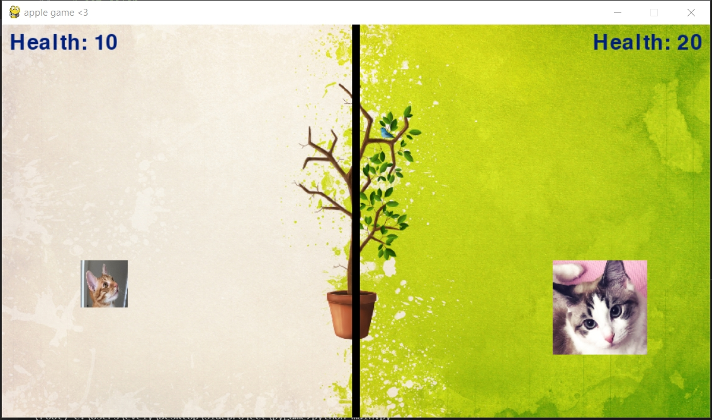

# pygame_shooting
It's a small program I did it for fun. <br />
I saw a pygame tutorial video on Youtube. <br />
I couldn't find the source toturial video with keyword "pygame shooting".<br />
I believed the I learned this from **techwithtim** or **freecodecamp**. <br />

## Dependencies
```
python3 -m pip install -U pygame --user
```

## How to play
1. start the program
```
python3 main.py
```
2. The game window will pop up.


3. Control
- orrange cat: Luca
    - w: up
    - a: left
    - s: down
    - d: right
    - bullet: left control
- white cat: Lumi
    - up: up
    - left: left
    - down: down
    - right: right
    - bullet: right control

4.  Have fun with your family or friend.